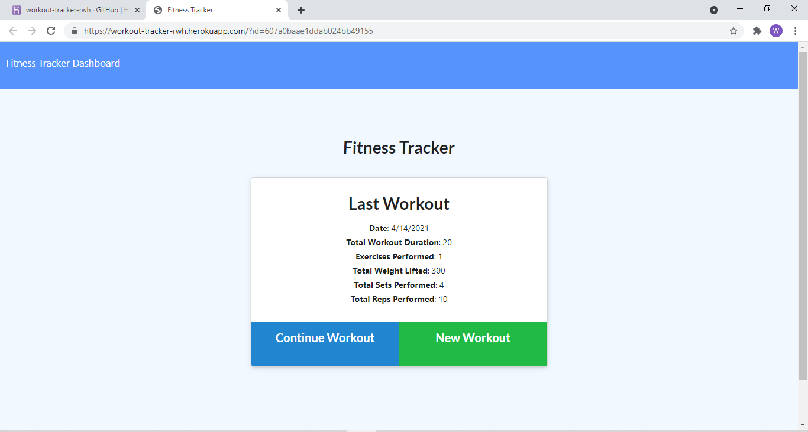
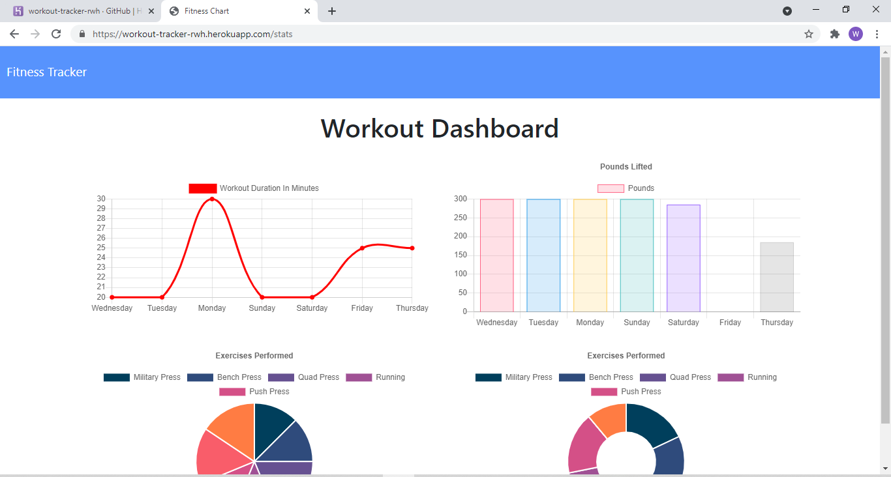

# WorkoutTrackerRWH

This app will allow users to add exercises to a workout and create new workouts. Users can then see data displayed in a chart, showing data from the latest 7 workouts. Workouts have useful information such as total weight and total duration. 

# Homepage & Dashboard

## License
  ​
This project is licensed under the Unlicensed license.
  
## Questions
  ​
If you have any questions about the repo, open an issue or contact me directly at BigRonald42@hotmail.com. You can find more of my work at [GitHub](https://github.com/BiggRonn/).

## Deployed App
https://workout-tracker-rwh.herokuapp.com